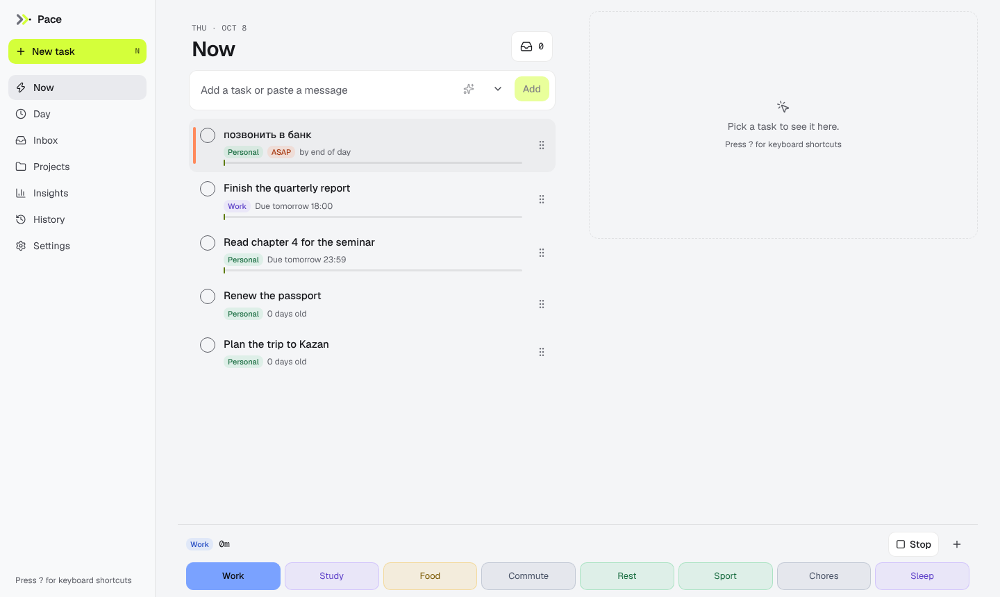
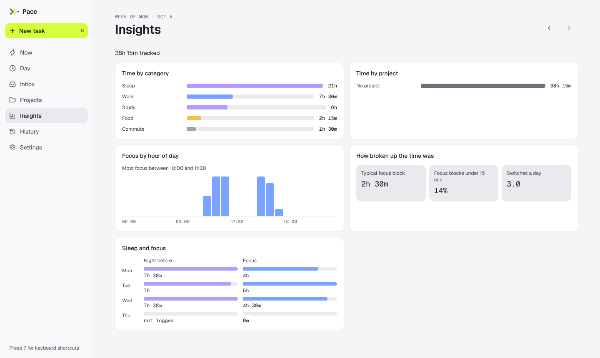
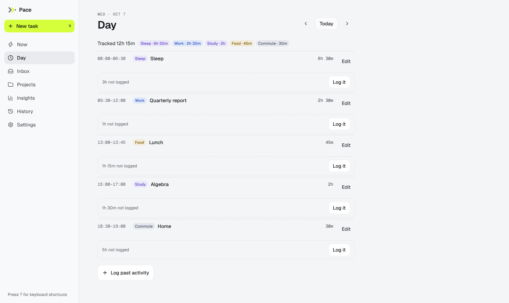
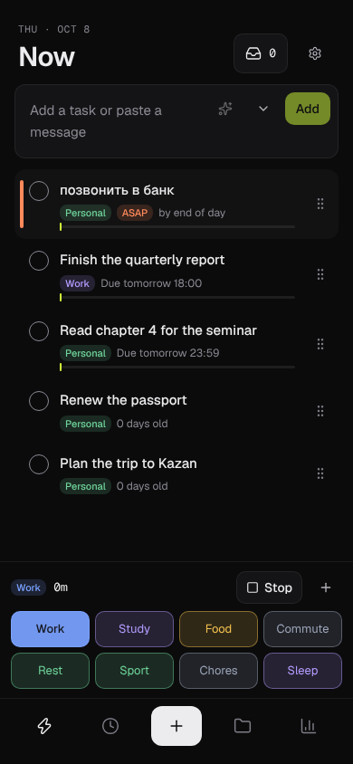

# Pace

A personal task and time tracker that runs at your own pace: an Android app, a web app,
a Telegram bot and an MCP server so Claude, ChatGPT and other assistants can
read and change your tasks. Everything you do is an **immutable event**; every client
keeps its own copy of the log (**local-first**) and syncs it to a **Cloudflare Worker**
that fits in the free tier. One TypeScript code base runs the same business rules on the
phone, in the browser and on the server.

## Status

| Stage | Scope | State |
|---|---|---|
| 0 — Foundation | shared core (events, materializer, settings, i18n, design tokens, API contract), Worker (Telegram auth, bot login, sync), typed client, CI/CD, deploy, brand assets | **done** |
| 1 — Tasks | presets (edited in the web UI), tasks and subtasks, urgency and the Now list, projects, inbox, history, MCP minimum with OAuth | **done** — deployed, `v0.1.0` |
| 2 — Language | free-text input parsed by an LLM, the full Telegram bot, notifications, decision log | **done** — deployed |
| 3 — Time | the time ledger: a time bar under Now (one tap switches, hold to edit a button's Expect/Limit), focus on a task, the Day timeline (gaps, log past, edit), Insights (time by category and project, on-time rate, estimate vs tracked), phone timers for Expect/Limit, a Limit alert through the bot, MCP time tools | **done** — `v0.3.0` |
| 4 — Phone and depth | phone data on Day (sleep, phone time per block, calendar), Settings → Permissions and a first-run walk-through, background checks, "ended at …?", calendar series rules, the messenger penalty; Insights by hour, fragmentation, sleep and focus; Excel export; LLM limits remembered and "read it when it's back"; MCP `query_sql`, `simulate`, `export_all` | **done** — `v0.4.0`, `v0.5.0` |

Still `v0.x`: the product is in daily use but not final.

| Now (desktop) | Insights (desktop) |
|---|---|
|  |  |
| **Day (desktop)** | **Now (phone, dark)** |
|  |  |

The screenshots are taken by `README_SHOTS=docs/screenshots bun test:e2e e2e/readme-shots.e2e.ts`
with a seeded week.

Phone data (`v0.3.1`, Android only): the Day screen reads the phone's own screen and app
events and its calendar, on the device. It proposes last night's sleep from the longest
screen-off stretch, shows phone time and top apps inside each block, and lists the day's
calendar events with Attended / Skip. Nothing is uploaded; only what you confirm becomes an
event. A first-run walk-through explains and asks for each permission (Settings →
Permissions later). See [Phone data on the device](#phone-data-on-the-device) for what to check.

The three product stages are each meant to be usable daily before the next one starts.

## Architecture

```
apps/app (Expo, Android) ─┐                         ┌─ Telegram (webhook: bot login, later digests)
apps/web (Vite + React) ──┼─► packages/client ─► apps/api (Cloudflare Worker, Hono)
   served by Worker       │   (typed API client,   │  /api/auth  /api/sync  /telegram/webhook
   pace-web (assets)      │    store — planned)    │
packages/core ◄───────────┘                        ├─ D1 "pace": users, sessions, login_nonces
  events + payload schemas, sort, materialize,     ├─ Durable Object UserStore (SQLite, one per user):
  settings reducer, i18n (en/ru), design tokens,   │    events, observations, decisions, meta
  zod API contract (endpoints)                     └─ KV OAUTH_KV (MCP OAuth clients, grants, tokens)
```

- `packages/core` is pure TypeScript (no I/O, no React) and is the only thing every
  runtime shares: the event model, the reducers and the API contract.
- `packages/client` turns that contract into a typed `fetch` client and holds the
  local-first app state, the auth flows and the sync loop; `createPaceClient` wires them
  on each platform's adapters (IndexedDB + localStorage on the web, SQLite + SecureStore
  on Android). View-models land here in stage 1.
- `apps/api` mounts the contract on Hono, verifies Telegram logins, serves the bot
  webhook and keeps one Durable Object per user as the server copy of the event log.
- `apps/web` and `apps/app` are thin UIs over the client.

[docs/architecture.md](docs/architecture.md) has the details: the event envelope,
corrections, deterministic ids, the sync protocol and the recipes for adding an endpoint
or an event type.

## Repository layout

```
packages/
  core/                 @pace/core — pure shared logic (src/core.ts is the public surface)
    src/api/            zod endpoint contract: endpoints.ts + schemas/{auth,sync}.ts
    src/events/         event-schema.ts (envelope + union), payloads.ts, sort.ts
    src/materialize/    materializer.ts (materialize/apply/corrections), settings-reducer.ts
    src/i18n/           en.ts (source of truth), ru.ts, i18n.ts (t, plural, formatters)
    src/design/         tokens.json (dark/light palettes), contrast.ts
    src/ids.ts, time.ts, result.ts
  client/               @pace/client — createPaceClient (api + auth + state + sync), ports and
                        memory adapters; ./react (createAppHooks, useStore); ./testing (fake fetch)
apps/
  api/                  Cloudflare Worker (Hono)
    src/worker.ts       entry: fetch handler + UserStore export
    src/app.ts          createApp(): CORS, config, error shape, route mounting
    src/auth/           Telegram widget HMAC, whitelist, sessions, nonces, routes
    src/bot/            grammY bot (login deep link) + webhook route
    src/sync/           push / pull / observations
    src/user-store/     Durable Object (drizzle on SQLite), event-log validation
    src/shared/         config (zod over env), mount() for contract endpoints, D1 schema
    drizzle/d1, drizzle/do   committed migrations (D1 and Durable Object)
    tests/              integration tests inside workerd
    wrangler.jsonc      bindings, vars, dev environment
  web/                  Vite + React 19 + Tailwind v4 (PWA); wrangler.jsonc = Worker pace-web
  app/                  Expo SDK 57 (expo-router, NativeWind); app.config.ts, plugins/, keystores/
e2e/                    Playwright + axe
scripts/                generate-tokens.ts (tokens.json → tokens.css), generate-icons.ts
assets/logo/            source SVGs of the mark, wordmark and favicon
.github/workflows/      ci, deploy, release, mutation, llm-regression
docs/                   architecture, testing, linting, presets
```

## Quick start

Prerequisites: [Bun](https://bun.sh) (the version in `.bun-version`). No Docker: the
Worker, D1, KV and the Durable Object run locally in `wrangler dev` (workerd).

```sh
bun install                                   # also installs the git hooks (lefthook)
cp .env.example apps/web/.env                 # optional: the defaults already point at the local Worker
cp apps/api/.dev.vars.example apps/api/.dev.vars   # optional: only needed for a real Telegram login
bun dev                                       # API on http://localhost:8787, web on http://localhost:5173
```

Without a bot token the API still starts; `POST /api/auth/telegram` answers 503 and the
bot webhook 503, while `POST /api/auth/dev { telegramId }` signs in any id listed in
`ALLOWED_TELEGRAM_IDS` (the `dev` environment in `wrangler.jsonc` is not `production`, so
the route exists).

| Command | What it does |
|---|---|
| `bun dev` | `wrangler dev` (API, port 8787) and Vite (web, port 5173) together |
| `bun lint` | every static check with auto-fix: tokens → Biome → ESLint → tsc (7 projects) → knip → jscpd → dependency-cruiser → migration drift. See [docs/linting.md](docs/linting.md) |
| `bun test:unit` | Vitest in `packages/core`, `packages/client`, `apps/web` (with coverage thresholds) |
| `bun test:api` | Vitest inside workerd with real D1 / KV / Durable Object bindings |
| `bun test:app` | jest-expo + React Native Testing Library |
| `bun test:e2e` | Playwright + axe against `wrangler dev` and the production web build |
| `bun test` | the four above, in that order |
| `bun test:mutation` | Stryker on core and web (slow; on demand in CI) |
| `bun test:llm` | LLM parsing regression set (stage 2; the runner does not exist yet) |
| `bun db:generate` | drizzle-kit migrations for both the D1 and the Durable Object schema |
| `bun db:check` | fails when a schema changed without a migration (part of `bun lint`) |
| `bun run build` | production build of the web app (`apps/web/dist`) |
| `bun run --cwd apps/app android` | `expo run:android` on a connected device or emulator |

Playwright needs a browser: `bunx playwright install --with-deps chromium`, or point
`PLAYWRIGHT_CHROMIUM_EXECUTABLE` at an installed Chromium. [docs/testing.md](docs/testing.md)
describes every level.

## How auth works

Pace has no passwords. Telegram is the identity provider and an optional **whitelist**
decides who may use a deployment: `ALLOWED_TELEGRAM_IDS` in `apps/api/wrangler.jsonc`
(comma-separated Telegram user ids). With ids set, anyone else gets `403 auth/not-allowed`
and never gets a user row; left empty (the default), the whitelist is off and any Telegram
account may sign in.

- **Web** — the [Telegram Login Widget](https://core.telegram.org/widgets/login) posts its
  payload to `POST /api/auth/telegram`. The Worker rebuilds the check string, verifies the
  HMAC-SHA-256 with the bot token (timing-safe), rejects payloads older than five minutes,
  checks the whitelist and mints a session.
- **Android** — the app calls `POST /api/auth/nonce` and opens the returned deep link
  `https://t.me/<bot>?start=login_<nonce>`. The bot (webhook `/telegram/webhook`) binds the
  nonce to the Telegram user who opened it, if whitelisted. The app polls
  `GET /api/auth/nonce/:nonce` every few seconds: `{ status: "pending" }` until bound, then
  once `{ status: "ready", token, user }` (the nonce is consumed in that call). Nonces live
  five minutes.
- **Sessions** are bearer tokens: 32 random bytes, only the SHA-256 is stored in D1, valid
  for 90 days, revoked by `POST /api/auth/logout`. `GET /api/me` returns the current user.
- **Local and tests** — `POST /api/auth/dev { telegramId }` exists only when
  `ENVIRONMENT` is not `production`.

Deployments for other people: edit `ALLOWED_TELEGRAM_IDS`, `TELEGRAM_BOT_USERNAME` and
`WEB_ORIGIN` in `wrangler.jsonc`, create your own bot (below) and set its token as a secret.

## Deployment

### Cloudflare resources

| Resource | Name / binding | Notes |
|---|---|---|
| Worker | `pace-api` | custom domain `pace-api.nalinor.dev`, `nodejs_compat`, observability on |
| Worker (static assets) | `pace-web` | `apps/web/wrangler.jsonc`, serves `apps/web/dist` with SPA fallback, custom domain `pace.nalinor.dev` |
| D1 | `pace` → binding `DB` | migrations in `apps/api/drizzle/d1`; `database_id` in `wrangler.jsonc` is a placeholder until `wrangler d1 create pace` |
| KV | binding `OAUTH_KV` | the MCP OAuth provider's clients, grants and tokens |
| Durable Object | class `UserStore` → binding `USER_STORE` | SQLite-backed, migration tag `v1` |

Create them once (`bunx wrangler d1 create pace`, `bunx wrangler kv namespace create OAUTH_KV`),
put the ids into `apps/api/wrangler.jsonc`, change the two custom domains to yours, and
either run `bunx wrangler deploy` in `apps/api` and `apps/web` or let the workflow do it.

### GitHub Actions

| Workflow | Trigger | Does |
|---|---|---|
| `ci.yml` | pull requests and pushes to `main` (not for docs-only changes), manual | one checks job (lint with a clean tree afterwards, `bun audit`, unit, app, api), then e2e once it passes; manual runs also build an arm64 **debug APK** artifact |
| `deploy.yml` | after a green CI on `main`, or manual | builds the web app with `VITE_API_URL=https://pace-api.nalinor.dev`, applies D1 migrations (`wrangler d1 migrations apply pace --remote`), deploys `pace-api` and `pace-web`, pushes the Worker secrets that are set, stores `BOT_INFO` (`getMe`), calls `setWebhook`, smoke-tests both hosts |
| `release.yml` | tag `v*` | lint + unit + api + app, builds the release APK (arm64-v8a), publishes a GitHub Release with `pace-vX.Y.Z.apk` |
| `mutation.yml` | manual | Stryker on core and web |
| `llm-regression.yml` | manual | `bun test:llm` with real providers (stage 2) |

Secrets and variables read by the workflows:

| Name | Kind | Used by | Purpose |
|---|---|---|---|
| `CLOUDFLARE_API_TOKEN` | secret | deploy | Workers Scripts, D1, KV, custom domains for the account |
| `CLOUDFLARE_ACCOUNT_ID` | variable (secret also accepted) | deploy | account the Workers live in |
| `TELEGRAM_BOT_USERNAME` | variable | deploy | baked into the web build as `VITE_TELEGRAM_BOT` (defaults to `PaceTaskTrackerBot`) |
| `TELEGRAM_BOT_TOKEN` | secret | deploy, Worker | widget verification and bot replies; without it login and the webhook stay disabled |
| `TELEGRAM_WEBHOOK_SECRET` | secret (optional) | deploy, Worker | string Telegram echoes on every webhook call; when unset, deploy derives it as the SHA-256 of the bot token |
| `TELEGRAM_WEBHOOK_ALLOWED_CIDRS` | var in `wrangler.jsonc` | Worker | comma-separated IPv4 CIDRs the webhook accepts calls from, checked against `CF-Connecting-IP`; default `149.154.160.0/20,91.108.4.0/22` ([Telegram's subnets](https://core.telegram.org/bots/webhooks#the-short-version)); empty = the check is off |
| `GROQ_API_KEY` | secret | deploy, llm-regression | LLM provider; several keys may be given (comma or newline separated): a key that hits its rate limit rests while the next one answers |
| `GEMINI_API_KEY` | secret | deploy, llm-regression | fallback LLM provider; several keys rotate the same way |
| `ANDROID_KEYSTORE_BASE64`, `ANDROID_KEYSTORE_PASSWORD`, `ANDROID_KEY_ALIAS`, `ANDROID_KEY_PASSWORD` | secrets | release | optional release keystore; absent → debug keystore |

Worker secrets are pushed with `wrangler secret put` only when the GitHub secret is set, so
a fork deploys without a bot token. `BOT_INFO` is stored as a secret too, by the workflow.
Non-secret configuration (`ENVIRONMENT`, `ALLOWED_TELEGRAM_IDS`, `TELEGRAM_BOT_USERNAME`,
`TELEGRAM_WEBHOOK_ALLOWED_CIDRS`, `WEB_ORIGIN`) lives in `wrangler.jsonc`.

## Android release

Releases are APKs on GitHub Releases, not the Play Store, and there are no OTA updates.
`apps/app/app.config.ts` derives `version` and `versionCode` from the tag (`v1.2.3` →
`1.2.3`, `10203`); untagged CI builds use the run number.

- **Signing today: the standard Android debug keystore**, committed at
  `apps/app/keystores/debug.keystore` (`android` / `androiddebugkey` / `android`).
  `apps/app/plugins/with-release-signing.js` makes release builds use it when no release
  keystore is configured, so every build has the same signature and installs over the
  previous one. Release notes say "debug-signed". Anyone can sign with that key, so the
  signature proves nothing about who built the APK (see [SECURITY.md](SECURITY.md)).
- **Switching to a real keystore**: generate one (`keytool -genkeypair -v -keystore
  release.keystore -alias pace -keyalg RSA -keysize 2048 -validity 10000`), add the four
  `ANDROID_*` secrets (`ANDROID_KEYSTORE_BASE64` is `base64 -w0 release.keystore`), and
  tag a release. The plugin reads them as Gradle properties `PACE_STORE_FILE`,
  `PACE_STORE_PASSWORD`, `PACE_KEY_ALIAS`, `PACE_KEY_PASSWORD`. Users must uninstall the
  debug-signed app once; the signature changes.
- **App Links**: `apps/web/public/.well-known/assetlinks.json` lists the SHA-256 of the
  signing certificate for package `dev.nalinor.pace`, so `https://pace.nalinor.dev/app/*`
  opens in the app (intent filter with `autoVerify` in `app.config.ts`). After switching
  keystores, replace the fingerprint (`keytool -list -v -keystore release.keystore`) and
  redeploy the web Worker.
- The native project (`apps/app/android`) is generated by `expo prebuild` and gitignored.
  CI uses JDK 17, NDK 27.1 and builds `arm64-v8a` only.

## Phone data on the device

This part depends on Android itself and is checked on a real phone, not in CI (CI compiles
the native code and runs the JS logic against mocks).

- **First run**: after login a short walk-through lists the four permissions Pace may use
  and why: notifications, calendar, usage access, alarms on time. It then asks for each
  one that is off, one at a time. A dialog moves on by itself. A settings screen moves on
  once you come back with it turned on, or you press Skip. "Not now" skips the whole thing.
  It is shown once per phone.
- **Settings → Permissions**: the same four, each with its state (on / off / turned off in
  Android settings) and one button. Calendar series you answered "every time" are listed
  there too, each with Forget.
- **Sleep**: after a night with the phone idle for at least 3 h touching 21:00–12:00,
  the Day screen shows a "Last night" card with the times and how often you woke up
  (screen-on glances up to 5 min are merged into the night). *Log sleep* writes a `sleep`
  block; *Not sleep* hides that guess on this phone.
- **Phone time per block**: under each block on Day, "Phone 25m: YouTube, Telegram…"
  sums foreground app time inside it. On work, study and task blocks, Pace also shows
  "counted …", which is the block's time minus a quarter of the messenger time.
  "Messaging was part of it" in the block's editor turns that off.
- **Ended at …?**: when a running activity is past its Expect and you pick up the
  phone, the running row on Day offers to end it at the moment of the pickup.
- **Calendar**: "From your calendar" lists the day's timed events from every visible
  calendar (all-day ones are skipped). *Attended* logs the event as a block, *Skip* hides it
  on this phone. For a repeating event, the toast offers *Every time*: the whole series is
  then logged when it ends, or always hidden. Exchange or work accounts appear only if
  Android syncs them into its calendar provider.
- **In the background**: about every half hour (Android decides exactly when), Pace looks
  at the phone with the app closed. It sends a notification about last night's sleep and
  about calendar events that just ended. Each one is asked about once, and a tap opens Day.

## Telegram bot setup

1. In [@BotFather](https://t.me/BotFather): `/newbot` → note the username and the token.
2. `/setdomain` → the web origin (`pace.nalinor.dev` for this deployment) so the Login
   Widget may run there. A bot has one widget domain.
3. Put the username into `TELEGRAM_BOT_USERNAME` (`wrangler.jsonc` and the GitHub
   variable), the token into the `TELEGRAM_BOT_TOKEN` secret; `TELEGRAM_WEBHOOK_SECRET` is optional
   (derived from the token when unset).
4. The deploy workflow sets the webhook to `https://<api host>/telegram/webhook` with
   that secret (`allowed_updates: message, callback_query`) and stores `getMe` as
   `BOT_INFO` so the Worker never calls Telegram on a cold start. For a manual setup call
   `setWebhook` yourself and `bunx wrangler secret put BOT_INFO` with the `result` of `getMe`.
5. The webhook answers only calls from [Telegram's subnets](https://core.telegram.org/bots/webhooks#the-short-version):
   `TELEGRAM_WEBHOOK_ALLOWED_CIDRS` in `wrangler.jsonc` (default
   `149.154.160.0/20,91.108.4.0/22`) is matched against the `CF-Connecting-IP` header,
   which Cloudflare sets itself on every request that reaches the Worker, so a caller
   cannot forge it. Any other address — or a missing header — gets `403 bot/forbidden-ip`
   (logged at warn level) before the secret token is even read; a typo in the list fails
   config loading with a message naming the entry. Set the var to an empty string to turn
   the check off, e.g. in `.dev.vars` when a tunnel that is not Cloudflare's (ngrok)
   delivers the webhook to `wrangler dev`. When Telegram changes its subnets, update the
   var and redeploy.

What the bot does, in the account language:

- `/start login_<nonce>` logs the app in (and opens the chat notifications go to).
- Any text is read by the assistant and answered with a preview — "I read it as: …" with
  the fields and anything it could not verify marked — and **Accept** / **To Inbox** /
  **Cancel**. Accept writes exactly the previewed events; nothing is written before. When no
  model has requests left, the text goes straight to the Inbox and the reply says when the
  assistant is back.
- `/now` lists the top five of Now.
- Notifications: digests at the account's digest times (09:00, 14:00, 21:00 by default)
  with the top of Now, what is left to sort and the Inbox count; a **critical** alert once
  per task when its deadline is within the preset's `criticalHours` and progress is below
  `criticalProgress`, or its score passes `criticalScore` (buttons: Snooze until the next
  digest, Done); a **stuck** report with the digest when a task waits longer than
  `waitingDays` or sits in progress untouched for `inProgressIdleDays` (Still waiting /
  Snooze, Cancel task). Nothing is sent in the quiet hours (23:00–08:00 by default): a
  crossing at night is reported in the morning. A deadline that was already critical before
  the previous check — a back-dated edit, or anything before notifications started — is
  logged as held back instead of sent; the digest shows it. The Durable Object's alarm
  drives all of it and re-arms itself after every write.

## MCP

Pace is an MCP server: `https://pace-api.nalinor.dev/mcp` (streamable HTTP) behind OAuth 2.1
with PKCE, dynamic client registration and a branded consent page on the web origin where you
sign in with Telegram and pick the scopes. Claude (web, desktop, Code), ChatGPT connectors,
Cursor and MCP Inspector connect with just that URL. The stage-1 tools cover the whole task
loop: `whoami`, `list_now`, `get_task`, `list_projects`, `list_project_tasks`,
`list_presets`, `list_inbox`, `list_review`, `search_decisions`, `search` and `fetch` (the pair ChatGPT needs)
to read (`tasks:read`); `create_task`, `capture_inbox`, `mark_subtasks`, `submit`,
`close_task`, `reopen`, `update_task`, `set_importance`, `set_status`, `set_rank`,
`add_subtasks`, `revoke_event`, `review_action`, `seed_example_presets`, `create_preset`,
`update_preset` and `archive_preset` to write (`tasks:write`). Every write takes `at`
(retroactive records), `precision` and `dryRun` (preview without writing), answers the
recorded event ids for undo, and refusals come back as tool errors (`isError`) that start
with the Result code. The tools read and write through your Durable Object, so they see
the state the apps sync: this week's homework instances and automatic outcomes are derived
before every read and after every write. [docs/mcp.md](docs/mcp.md) has
the setup per client, the tools table, the scopes, the consent flow and local testing.

## LLM providers

Free text ("дз 7 по алгебре 1, 3, 5а до среды 23:59") is read by an LLM through the Vercel
AI SDK: **Groq** (`openai/gpt-oss-120b`, strict JSON schema) first, **Gemini**
(`gemini-flash-latest`) when Groq is rate limited, and a **fake** provider
(`LLM_PROVIDER=fake`) in tests and the e2e Worker. Keys come from the `GROQ_API_KEY` and
`GEMINI_API_KEY` secrets; a provider without a key is skipped, and with none the assistant
reports itself unavailable. The prompt (categories, projects, open tasks, now, zone) stays
under 3k tokens, the free tier's per-minute budget.

The LLM never rewrites your text: the line is stored verbatim, every extracted string must
be a literal quote of it, and numbers and dates need a quote as evidence — anything else
comes back marked "check this". Where it is used:

- `POST /api/parse` — the composer's **Read with AI** (web and app) fills the same chips
  the rule-based reading does; questions show as one-tap answers.
- The bot's previews (above).
- `GET /api/decisions` and the **Decision log** page (Settings), plus the MCP tool
  `search_decisions`: every parse and every notification sent or held back, with the rule,
  its inputs and a one-line explanation.

**When the free tier runs out**: a provider's rate limit is remembered (from its
`retry-after`) and skipped until then, so the next calls go straight to the one still
answering; `GET /api/llm/status` says whether the assistant can read now and when it is back.
With every provider out, the composer offers **Read it when it's back**: the line is kept in
your Durable Object and read at that time, then written as read (History can undo it) or put in
the Inbox if it cannot be placed or is still unread a day later. The bot does the same with any
message and writes back once it has read it.

The Android app mirrors `GET /api/notify/plan` into local reminders (digest windows and
deadline crossings for the next day) after every sync; it has no rules of its own.

## License

[MIT](LICENSE).
